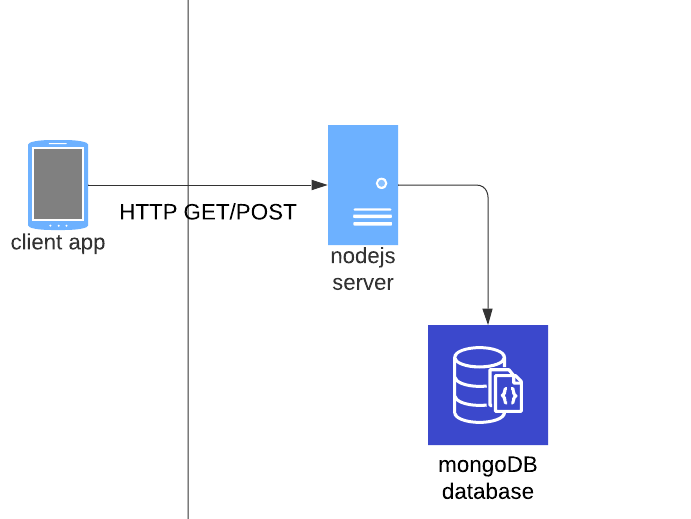
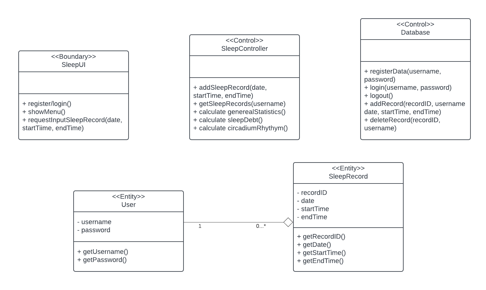
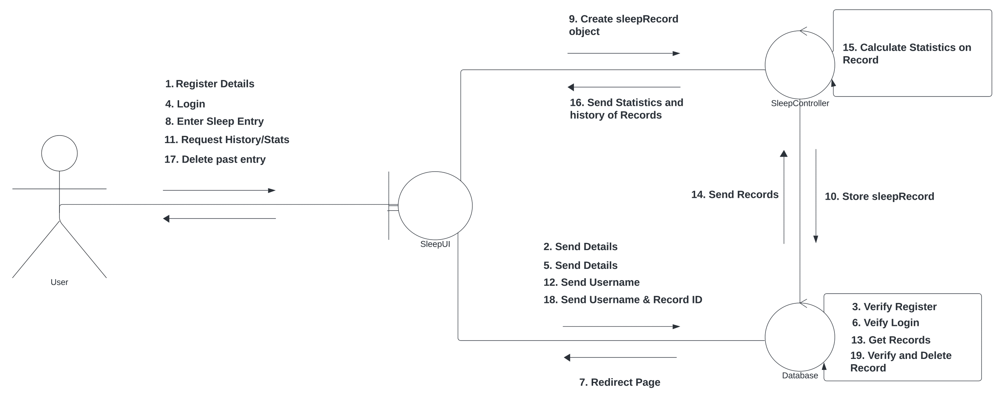

# Sleep Tracker & Calculator
#### [JIRA](https://mail-team-xsccm6lw.atlassian.net/jira/software/projects/SCRUM/boards/1)
## 1 Abstract
The purpose of this app is twofold:
1. Help users track their sleep so that they can understand when and for how long they sleep. Tracking this information will help users to understand trends in their sleep schedule, duration, and quality.
2. Use data on sleep cycles to guide users on when best to fall asleep/wake up to maximize sleep quality without compromising on duration.

## 2 Introduction
Have you ever laid in bed, eyes closed, but feel wide awake? That is the case for many, and in todays world, getting a good night of sleep is more important than ever. However, understanding and improving sleep habits can be a challenge for many. Introducing our Sleep Tracker & Calculator app, it is designed to revolutionize the way users go about their sleep routine. This tool not only helps users track their sleep patterns, but also provides insight into sleep quality and duration. By analyzing data gathered on sleep cycles, the app offers personalized recommendations on the optimal times to fall asleep and wake up. Whether you're struggling with insomnia, jet lag, or simply want to optimize your sleep schedule, our app is your solution for achieving a good night of sleep.

## 3 Architectural Design
Our software is designed to use a client-server architecture. The client is in the form of an interactive app where the user can enter their sleep information and request good times to wake up/fall asleep. The server, using node, will process the sleep calculations and send sleep tracking information to and from mongoDB. So when the client requests sleep tracking data from the server, the server then gets that from the database and responds with both those records and an analysis of that data. Similarly, when the client requests the best time to wake up/fall asleep, the server performs that requisite calculations and responds with the results.

  

### 3.1 Class Diagram
This portion contains diagrams for the design of our software. Consisting of one boundary class, two control classes, and two entity classes, below we have a visual representation of the flow of data and interactions within the system.

### 3.2 Sequence Diagram
The sequence diagram shows the flow of data through the system, and how the intricate parts of the system communicate with each other. It shows the sequence for registering and logging into an account, and entering/deleting an entry. Starting off, the UI is loaded and presents a regristration/login page. When a user registers the details of an account, the data is sent to the Database class where it is verified. Once verified, the account will be created and the user will still be prompted to login. After requesting to login, the data will again be sent to the database and verify if the information is right. When the user login is accepted, the page will redirect to the main dashboard. From there the user may choose to enter an entry, where the data is then sent to the sleepController class. This class will verify and store the data in an instance of a sleepRecord. The record will then be sent to the database class where it is then uploaded and stored. If the user wishes to see their history, their username will be sent to the database. The records associated with the same username gets pulled, where it is then sent to the sleepController class. This class will use mathematics to find trends, and send the calculations and records back to the UI.

### 3.3 Usecase Diagram
The usecase diagram shows how the user may interact with the system.

### 3.4 Communication Diagram

## 4 User Guide/Implementation
### 4.1 Client Side
#### 4.1.1 Installing the Application
Users will need to install the application "TBD" onto an Android device.  An icon representative of the app will then be added to the home screen of the user's device.
#### 4.1.2 Landing Page
Upon opening the application, the user is greeted to an input query in which they can provide the times for the start and end of their last sleep cycle.  The graph top and center is there to help as a visual indicator of how much sleep was had, with each tick representing a half an hour.  Additionally feedback on the total amount of sleep they experienced and the average amount of sleep they get each night will be returned given the timeframe of one week prior.  Three icons will line the bottom of the screen that will help navigate to a more in depth statistics page, navigate a settings page, or reload a new fun fact that will be placed on the landing page.

  

#### 4.1.3 Statistics Page
Upon navigation to the statistics page, the user is greeted with a larger sample size of data given within the span of the previous month.

  

## 5 Future Scope
There are several possibilities for the future scope of this project. Currently this software provides an estimate of the best time to wake up/fall asleep but doesn't do much beyond that simple calculation. In the future we may expand this so that it can act as an alarm clock or tailor the calculations for the specific user and their sleep patterns. The sleep tracking portion may also provide more detailed analysis of the user's sleep patterns and how they've changed over time.

## 6 Conclusion
Our Sleep Tracker & Calculator app aims to encourage users to take control of their sleep habits and improve their quality of life. By providing insight, this app has the potential to change the way how people approach sleep. As we continue to refine and enhance this project, the team is excited to help you on your journey.

